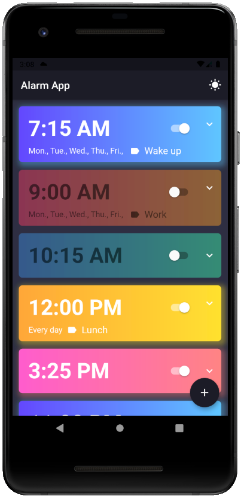
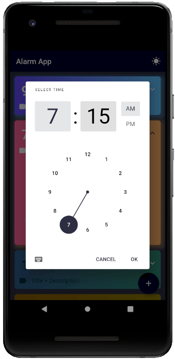

# Alarm App

**Raymond Mei** - Last Functional Test: August 2021

Flutter and Firebase application that schedules alarms and notifications

---

## Features

1. All data is stored both locally and on the cloud in Firestore

2. Add a new alarm

    - Set time using Material Time Picker
    - Set alarm to repeat on specific days of the week
    - Set alarm title/label

3. Disable an alarm

4. Delete an alarm

5. Notification at the exact scheduled time

6. Dark and light mode

---

#### *Notes*

- Some features are currently not available

    - Vibrate, alarm sound, alarm intents, alarm screen, etc.
    - Flutter does not support many of these features (or it was too difficult to implement)

- Certain Flutter features may become deprecated, app is working until last update date
    
- Only tested with Android
    
- Dark/Light mode only changes background for now, might update in the future (*might*)

- Might also add additional features and optimizations later

---

#### Screenshots

    
        
     
        
    

