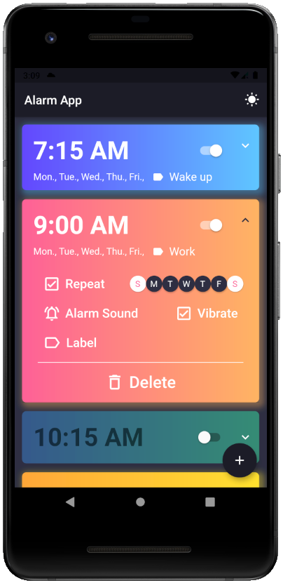

# Alarm App

**Raymond Mei** - Last Functional Test: August 2021

Flutter application that creates scheduled alarms and notifications

---

## Features

1. Add a new alarm

    - Set time using Material Time Picker
    - Set alarm to repeat on specific days of the week
    - Set alarm title/label

2. Disable an alarm

3. Delete an alarm

4. Notification at the exact scheduled time

5. Dark and light mode

---

#### *Notes*

- Some features are currently not available

    - Vibrate, alarm sound, alarm intents, alarm screen, etc.
    - Flutter does not support many of these features (or it was too difficult to implement)
    
- Only tested with Android
    
- Dark/Light mode only changes background for now, might update in the future (*might*)

- Might also add additional features and optimizations later

---

#### Screenshots

    
        
     
        
    

